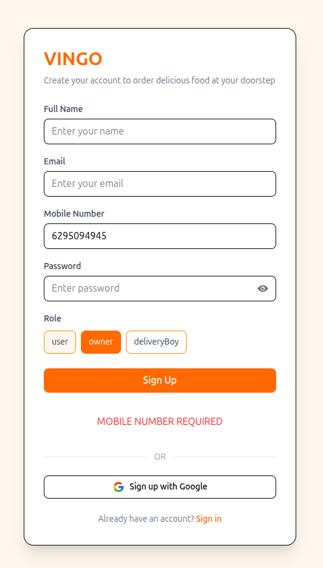
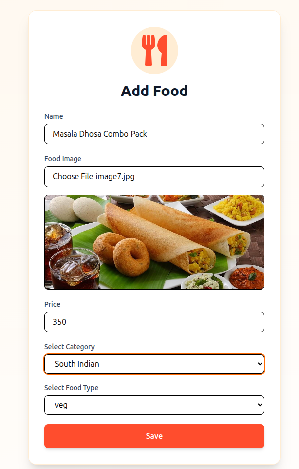
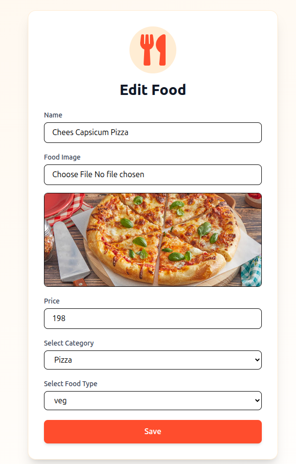
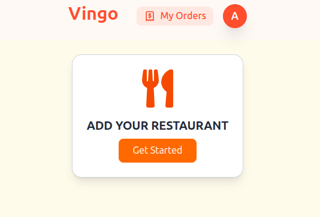

🍔 Food Delivery App (MERN + Realtime + Payments)

A full-stack food delivery platform with Google authentication, JWT security, Razorpay payments, real user reviews, and location-based  shop & item discovery with live location tracking to delivery .

🚧 ----------------------------Actively in development — core system functional, scaling features being refined.

---- screenshot of UI ____
## 📸 Screenshots

### User Home

### User UI 2

### Login Page

### Signup Page

### Owner Dashboard

### Shop Owner Page

### Add Food

### Edit Food

### Owner Add Food UI

✨ Key Features
🔐 Authentication & Security

JWT login/signup

Google OAuth verification

Password reset via email token

Protected routes & role-based access

Secure cookies + bcrypt hashing

📍 Location-Based System

Detect user city/location

Show shops based on user city

Show food items from nearby shops

Location stored per shop

City filtering API

Users only see relevant shops & food available in their location.

🛒 Ordering System

Add to cart

Quantity control

Place order

Order history

Order status tracking

💳 Razorpay Payment Integration

Secure Razorpay checkout

Online payments

Order created only after payment success

Payment verification on backend

Razorpay webhook support (optional)

Payment status stored in DB

⭐ Real User Reviews & Ratings

Users can review purchased items

Rating system (1–5 stars)

Review linked to real order

Average rating calculation

Shop/item review display

Prevents fake reviews — only verified buyers can review.

🏪 Shop Owner Dashboard

Create/edit shop

Upload food images

Manage items

View orders

View reviews

Track earnings

📡 Realtime Tracking (in progress)

Live order status updates

Socket.io integration

Delivery tracking flow

🛠 **************************Tech Stack
Frontend

React

Tailwind CSS

Redux Toolkit

Axios

Backend

Node.js

Express.js

MongoDB

Mongoose

Auth

JWT

Google OAuth

Payments

Razorpay

Realtime

Socket.io

Storage

Cloudinary (image uploads)

// --- PROJECT STRUCTURE 
client/
 ├── components/
 ├── pages/
 ├── redux/
 ├── hooks/

server/
 ├── controllers/
 ├── models/
 ├── routes/
 ├── middleware/
 ├── utils/
 ├── payments/

 // 
 // Environment Variables (DEMO)
 PORT=8000
MONGO_URI=your_mongo

JWT_SECRET=your_secret

GOOGLE_CLIENT_ID=xxx
GOOGLE_CLIENT_SECRET=xxx

RAZORPAY_KEY_ID=xxx
RAZORPAY_KEY_SECRET=xxx

CLOUDINARY_NAME=xxx
CLOUDINARY_KEY=xxx
CLOUDINARY_SECRET=xxx

-----------------------CLONE _______________
git clone https://github.com/yourusername/food-delivery-app
cd food-delivery-app

------------------------ BACKEND ---------------------------------------
cd server
npm install
npm run dev

------------------------FRONTEND--------------------------------------
cd client
npm install
npm run dev

