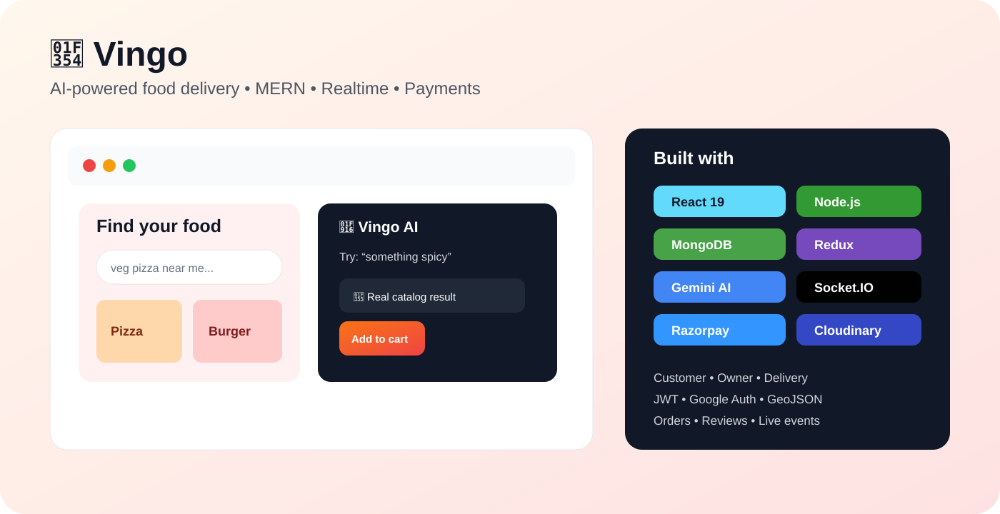
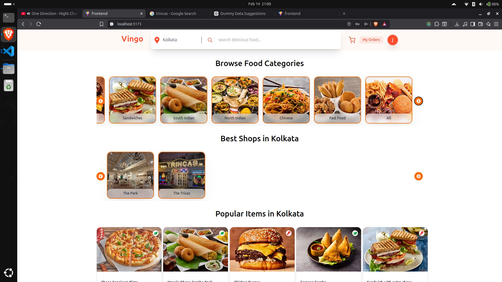
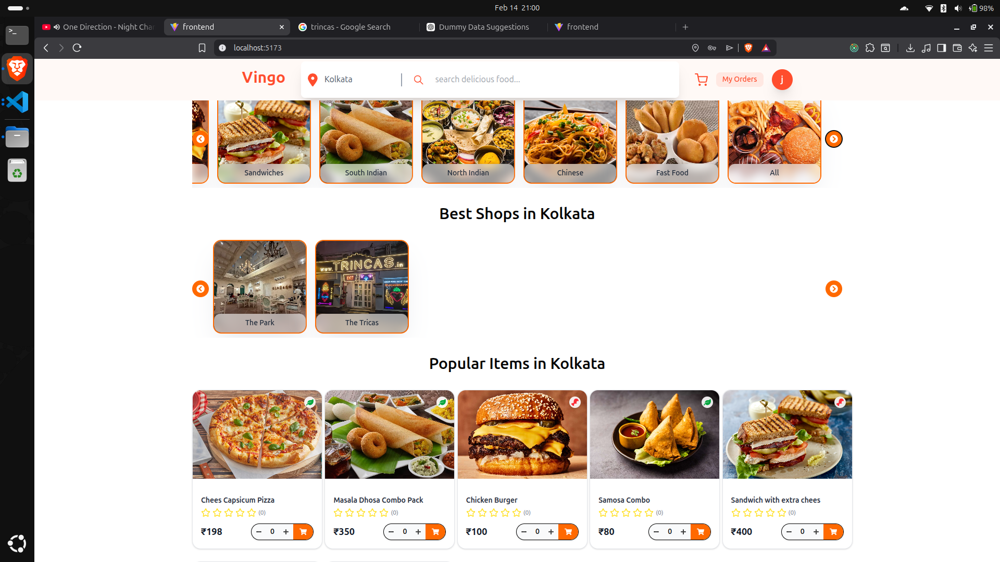
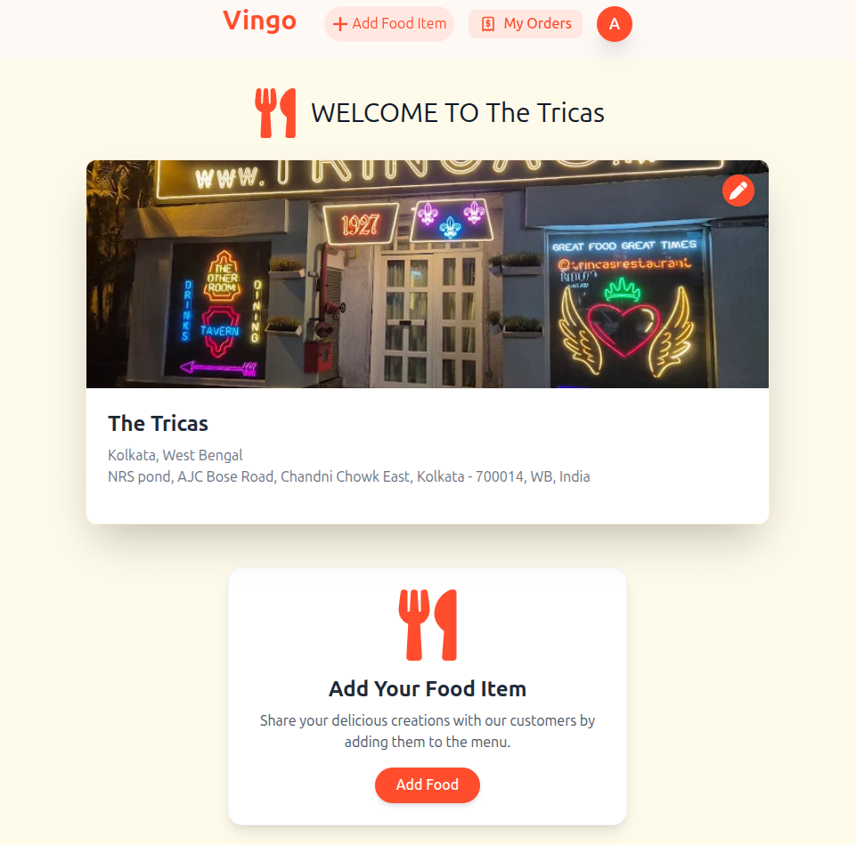
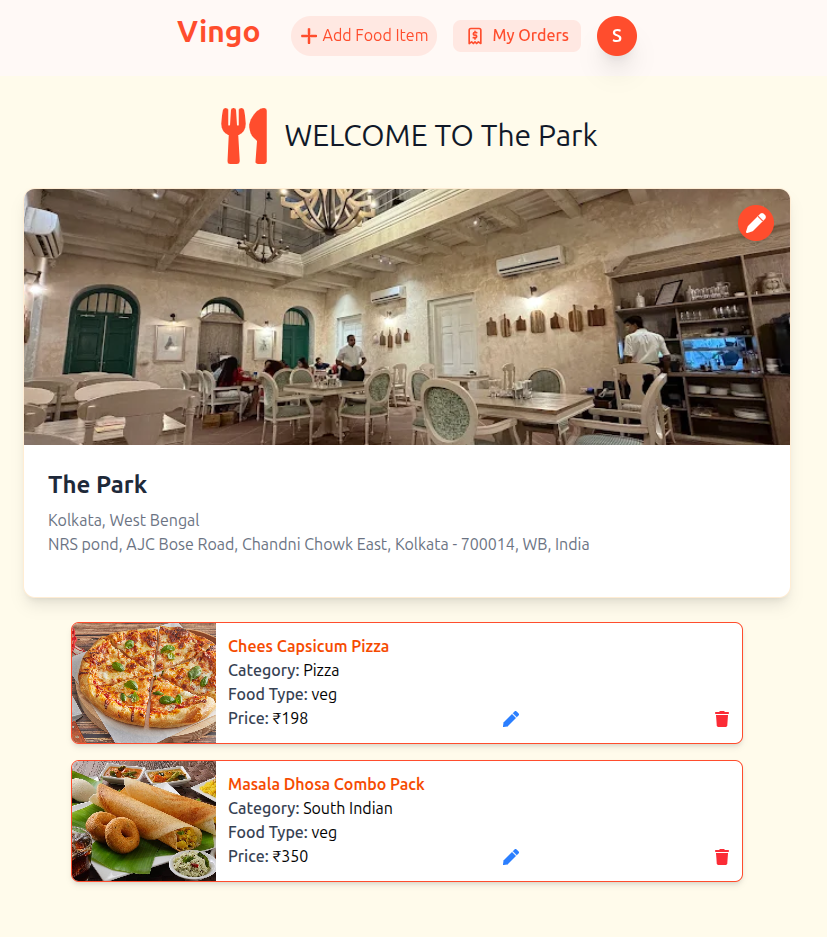
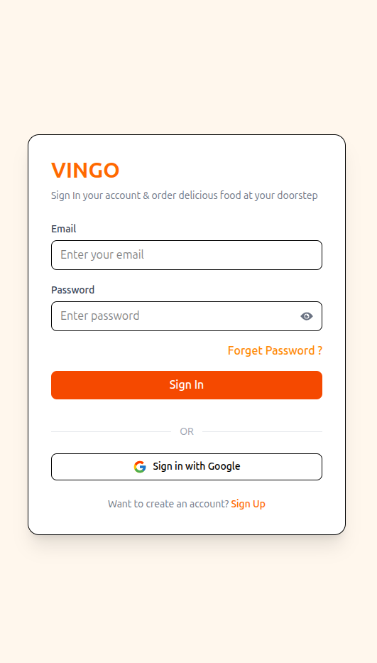

# 🍔 Vingo — AI Food Delivery Platform

<p align="center"></p>

<p align="center"><strong>A production-style MERN food-delivery platform combining AI food discovery, location-aware discovery, secure authentication, realtime order communication, payments, reviews, and separate customer / owner / delivery workflows.</strong></p>

<p align="center">
  <a href="https://vingo-food-delivery-cnjr.vercel.app">🚀 Live Demo</a> ·
  <a href="https://vingo-food-delivery-rust.vercel.app">⚙️ Backend API</a> ·
  <a href="https://github.com/duttasirius/vingo-Food-Delivery">💻 Source</a> ·
  <strong>Development branch: dev</strong>
</p>

## ⚡ At a Glance

| Area | Implementation |
|---|---|
| 🖥️ Frontend | React 19, Vite, Tailwind CSS, React Router |
| 🧠 AI | Google Gemini + deterministic catalog fallback |
| ⚙️ Backend | Node.js, Express 5, REST APIs |
| 🗄️ Database | MongoDB + Mongoose |
| 🔐 Auth | JWT, HTTP-only cookies, Google Auth, OTP reset |
| 📍 Location | GeoJSON + MongoDB 2dsphere |
| 🔄 Realtime | Socket.IO |
| 💳 Payments | Razorpay + server-side verification |
| ☁️ Media | Cloudinary |
| 🧠 State | Redux Toolkit |

## 🚀 What I Built

Vingo models a real food-delivery workflow rather than a basic CRUD demo:

```text
Discover → Search → Restaurant/Menu → Cart → Checkout → Payment → Order → Delivery
```

### 🤖 AI Food Assistant

Users can search naturally — `veg pizza`, `something spicy`, `I want something sweet`, partial names, or common misspellings. Gemini interprets intent, but **MongoDB remains the source of truth**.

```text
User query
   ↓
React AI chat
   ↓
Express /api/item/ai-search
   ↓
MongoDB catalog context
   ↓
Gemini intent + item IDs
   ↓
Server validates IDs
   ↓
AI + deterministic matches
   ↓
Real food cards → Redux cart
```

**Reliability:** if Gemini fails, deterministic matching can still return catalog results. This avoids making an external AI service a single point of failure for shopping.

### 📍 Location-Aware Discovery

- City-aware restaurant discovery
- GeoJSON-compatible location data
- MongoDB `2dsphere` indexing
- Relevant shop/menu discovery based on location

### 🔄 Realtime Delivery Foundation

- Socket.IO integration
- Delivery role and dashboard
- User/socket identity mapping
- Realtime order events
- Delivery tracking foundation

### 🏪 Three-Sided Product Workflow

**Customer:** browse, search, AI discovery, cart, checkout, orders, reviews.

**Shop Owner:** create/manage shop, upload images, manage menu, receive orders, view performance.

**Delivery:** delivery dashboard, order-related realtime events and tracking foundation.

### 🔐 Authentication & Security

- JWT authentication with HTTP-only cookie
- Password hashing with bcryptjs
- Protected API middleware
- Role-aware flows: `user`, `owner`, `deliveryBoy`
- Google authentication
- OTP password reset
- Credentialed CORS configuration

### 💳 Payments & Commerce

- Razorpay checkout
- Backend-side payment verification
- Payment state stored with orders
- Cart → checkout → order lifecycle
- Verified-buyer reviews and 1–5 star ratings

## 🖼️ UI Showcase

<p align="center">
  
  
</p>

<p align="center">
  
  
</p>

<p align="center"></p>

## 🏗️ Architecture

```text
React + Vite + Tailwind
          │
       Axios/HTTP
          ▼
     Express 5 API
    ┌─────┼───────────┐
    ▼     ▼           ▼
 MongoDB Cloudinary  Gemini
    │                 │
    ├─ Users          └─ AI intent
    ├─ Shops              + catalog IDs
    ├─ Items                   │
    ├─ Orders                  ▼
    └─ Reviews          server validation
          │
          ├──── Razorpay
          └──── Socket.IO
```

## 🧰 Stack

**Frontend:** React 19 · Vite · Tailwind CSS · Redux Toolkit · React Router · Axios · Leaflet/React Leaflet · Socket.IO Client · Lucide React

**Backend:** Node.js · Express 5 · MongoDB · Mongoose · JWT · bcryptjs · Cookie Parser · CORS · Socket.IO · Nodemailer · Multer · Cloudinary · Razorpay

**AI:** Google Gemini · hybrid AI + deterministic catalog matching

## 🎯 Interview Talking Points

- Why AI output is treated as untrusted input
- Why the database stays the source of truth
- How deterministic fallback improves resilience
- JWT + HTTP-only cookie security model
- GeoJSON / `2dsphere` location querying
- Event-driven order updates with Socket.IO
- Payment verification and order consistency
- Role separation across customer, owner and delivery workflows

## 📁 Structure

```text
vingo-Food-Delivery/
├── frontend/        # React application
├── backend/         # Express API, models and integrations
├── UI-SCREENSHOT/   # Product UI showcase
└── README.md
```

## 🔑 Local Setup

```bash
git clone -b dev https://github.com/duttasirius/vingo-Food-Delivery.git
cd vingo-Food-Delivery

cd backend && npm install && npm run dev
# second terminal
cd frontend && npm install && npm run dev
```

Configure MongoDB, JWT, Gemini, Razorpay, Cloudinary and SMTP credentials through environment variables. Never commit real secrets.

## 📌 Recruiter Snapshot

**Vingo demonstrates:** full-stack MERN architecture · REST APIs · authentication · RBAC-style workflows · geolocation · realtime systems · payments · media uploads · transactional email · Redux state management · AI grounding · fallback architecture · responsive React UI.
